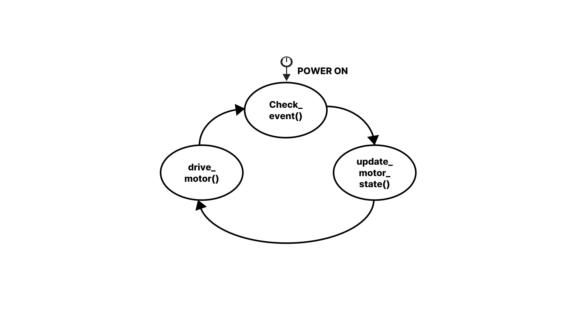
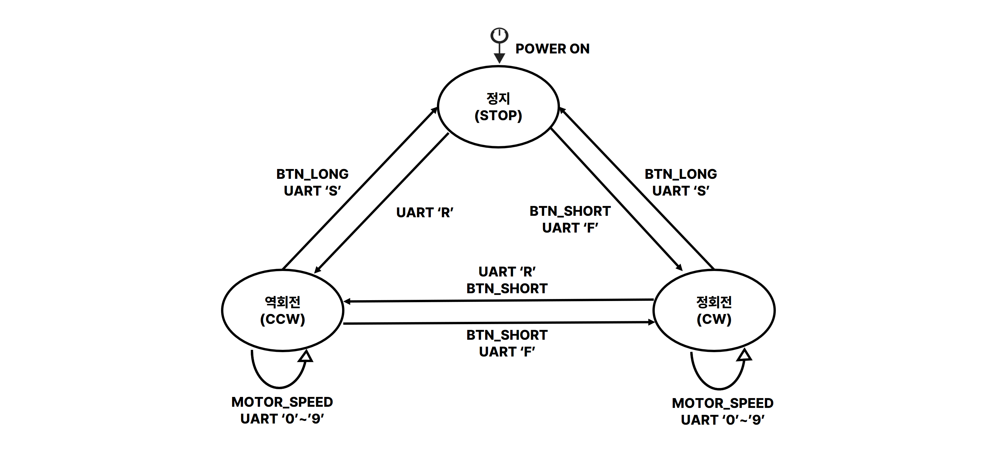

# [3조] 모터 제어 상위설계서

신유지, 이호윤, 이양배, 한소영

## 요구 사항

* 모터는 버튼과 UART 명령 두 가지 방식으로 제어
* 시스템 시작 시 모터는 정지 상태
* 메인 루프는 UART 처리, 버튼 처리, 모터 상태 처리를 반복 수행
* 방향 전환 시 모터 부하 방지를 위해 전환 간 대기시간 동작
* UART PWM Duty 범위는 50~95%
* 위 요구사항에 명시되지 않은 세부 구현 방식은 자유롭게 설계

## 1. STATE

### 1-1. FSM

**다이어그램 1. 메인 동작 흐름**



**다이어그램 2. 모터 상태 전이**




### 1-2. MOTOR STATE

| 이름 | 값 | 설명 |
|---|:---:|---|
| `STOP` | `0` | 모터 정지 |
| `CW` | `1` | 모터 정회전 |
| `CCW` | `2` | 모터 역회전 |

### 1-3. MOTOR SPEED

| UART 명령 | Duty 값 | 설명 |
|:---:|:---:|---|
| `'0'` | `50` | PWM Duty 50% 설정 |
| `'1'` | `55` | PWM Duty 55% 설정 |
| `'2'` | `60` | PWM Duty 60% 설정 |
| `'3'` | `65` | PWM Duty 65% 설정 |
| `'4'` | `70` | PWM Duty 70% 설정 |
| `'5'` | `75` | PWM Duty 75% 설정 |
| `'6'` | `80` | PWM Duty 80% 설정 |
| `'7'` | `85` | PWM Duty 85% 설정 |
| `'8'` | `90` | PWM Duty 90% 설정 |
| `'9'` | `95` | PWM Duty 95% 설정 |

`'0'`~`'9'` 명령은 모터가 `CW` 또는 `CCW` 상태일 때만 적용

## 2. EVENT (BUTTON/UART)

### 2-1. BUTTON/UART 이벤트

| 이름 | 값 | 설명 |
|---|:---:|---|
| `EVT_NONE` | `0` | 이벤트 없음 또는 이벤트 완료 |
| `EVT_BTN_SHORT` | `1` | 버튼이 3000ms 전에 해제 |
| `EVT_BTN_LONG` | `2` | 버튼을 누른 상태로 3000ms 경과 |
| `EVT_UART` | `3` | UART 문자 수신. 수신 문자는 ISR에서 `uart_data`에 저장 |

### 2-2. 상태별 이벤트 처리표

| 현재 상태 | 입력 이벤트/명령 | 다음 상태 | 실제 처리 | 전환 전 정지 지연 |
|---|---|---|---|:---:|
| `STOP` | 버튼 짧게 누름 | `CW` | `Apply_Motor_State(CW)` → `Motor_CW()` | 없음 |
| `STOP` | 버튼 길게 누름 | `STOP` | 상태 변경 없음 | 없음 |
| `CW` | 버튼 짧게 누름 | `CCW` | `Motor_Wait()` → `Apply_Motor_State(CCW)` → `Motor_CCW()` | 200ms |
| `CW` | 버튼 길게 누름 | `STOP` | `Apply_Motor_State(STOP)` → `Motor_Stop()` | 없음 |
| `CCW` | 버튼 짧게 누름 | `CW` | `Motor_Wait()` → `Apply_Motor_State(CW)` → `Motor_CW()` | 200ms |
| `CCW` | 버튼 길게 누름 | `STOP` | `Apply_Motor_State(STOP)` → `Motor_Stop()` | 없음 |
| `STOP` | UART `'f'`/`'F'` | `CW` | `Apply_Motor_State(CW)` → `Motor_CW()` | 없음 |
| `CCW` | UART `'f'`/`'F'` | `CW` | `Motor_Wait()` → `Apply_Motor_State(CW)` → `Motor_CW()` | 200ms |
| `CW` | UART `'f'`/`'F'` | `CW` | 상태 변경 없음 | 해당 없음 |
| `STOP` | UART `'r'`/`'R'` | `CCW` | `Apply_Motor_State(CCW)` → `Motor_CCW()` | 없음 |
| `CW` | UART `'r'`/`'R'` | `CCW` | `Motor_Wait()` → `Apply_Motor_State(CCW)` → `Motor_CCW()` | 200ms |
| `CCW` | UART `'r'`/`'R'` | `CCW` | 상태 변경 없음 | 해당 없음 |
| `CW`, `CCW` | UART `'s'`/`'S'` | `STOP` | `Apply_Motor_State(STOP)` → `Motor_Stop()` | 없음 |
| `STOP` | UART `'s'`/`'S'` | `STOP` | 상태 변경 없음 | 해당 없음 |
| `CW`, `CCW` | UART `'0'`~`'9'` | 현재 상태 유지 | `Motor_Set_Duty()` | 해당 없음 |
| `STOP` | UART `'0'`~`'9'` | `STOP` | 명령 무시 | 해당 없음 |

## 3. PWM 및 타이머

### 3-1. TIM2 모터 PWM

| 항목 | 설정값 |
|---|---|
| TIM2 입력 클록 | `TIMXCLK` (`96 MHz` 기준) |
| TIM2 카운터 클록 | `1 MHz` |
| PWM 주파수 | `1 kHz` |
| Prescaler | `95` (`TIMXCLK = 96 MHz` 기준) |
| ARR | `999` |
| 출력 채널 | CH1 (`PA0`), CH2 (`PA1`) |
| 카운터 모드 | Down counter |
| 반복 모드 | Repeat |
| 부팅 직후 CCR | `CCR1 = 0`, `CCR2 = 0` |
| 회전 시작 Duty | 50% |
| UART Duty 범위 | 50~95% |

### 3-2. TIM5 버튼 3초 인지 타이머

| 항목 | 설정값 |
|---|---|
| TIM5 입력 클록 | `TIMXCLK` (`96 MHz` 기준) |
| TIM5 카운터 주파수 | `10 kHz` |
| Prescaler | `9599` (`TIMXCLK = 96 MHz` 기준) |
| ARR | `3000 * 10 - 1` = `29999` |
| 길게 누름 설정값 | `3000 ms` |
| 카운터 모드 | Down counter |
| 원샷 모드 | One-pulse |
| 인터럽트 | Update interrupt, IRQ 50 |

### 3-3. 방향 전환 대기

| 항목 | 설정값 |
|---|---|
| 대기시간 | `MOTOR_REVERSE_WAIT_MS` = `200 ms` |
| 시간 기준 | SysTick |
| 대기 방식 | Non-blocking |
| 적용 조건 | `CW ↔ CCW` 방향 전환 |

## 4. VARIABLE

### 4-1. 열거형

```c
typedef enum
{
    STOP,
    CW,
    CCW
} MotorState_t;

typedef enum
{
    EVT_NONE,
    EVT_BTN_SHORT,
    EVT_BTN_LONG,
    EVT_UART
} Event_t;
```

### 4-2. 전역 및 모듈 상태 변수

| 이름 | Type | 초기값 | 범위 | 역할 및 변경 시점 |
|---|---|---|---|---|
| `event` | `volatile Event_t` | `EVT_NONE` | 전역 | `Button_Event_Handle()`, `Uart_Event_Handle()`, `TIM5_IRQHandler()`에서 설정하고 `Update_Motor_State()`에서 소비 후 초기화 |
| `motor_state` | `volatile MotorState_t` | `STOP` | 전역 | 현재 모터 상태. `Apply_Motor_State()`에서 갱신 |
| `pwm_active_state` | `static MotorState_t` | `STOP` | `motor.c` | 현재 PWM 출력 방향. `Motor_CW()`, `Motor_CCW()`, `Motor_Stop()`에서 갱신 |
| `duty_table` | `static const unsigned char[10]` | `50`~`95` | `motor.c` | UART 숫자 명령을 Duty 값으로 변환 |
| `new_motor_state` | `static MotorState_t` | `STOP` | `motor.c` | 이벤트 처리 후 목표 모터 상태 |
| `motor_speed` | `static int` | `50` | `motor.c` | 현재 논리적 PWM Duty 값 |
| `new_motor_speed` | `static int` | `50` | `motor.c` | 적용할 목표 PWM Duty 값 |
| `waiting_reverse` | `static volatile int` | `0` | `motor.c` | 방향 전환 대기 중 여부 |
| `pending_state` | `static MotorState_t` | `STOP` | `motor.c` | 대기 완료 후 적용할 모터 방향 |
| `Key_Pressed` | `volatile int` | `0` | 전역 | EXTI ISR에서 버튼 눌림 시 1로 설정하고 `Button_Event_Handle()`에서 0으로 초기화 |
| `Key_Released` | `volatile int` | `0` | 전역 | EXTI ISR에서 버튼 해제 시 1로 설정하고 `Button_Event_Handle()`에서 0으로 초기화 |
| `uart_flag` | `volatile unsigned char` | `0` | 전역 | USART2 ISR에서 1로 설정하고 `Uart_Event_Handle()`에서 0으로 초기화 |
| `uart_data` | `volatile unsigned char` | `0` | 전역 | USART2 ISR에서 마지막으로 수신한 문자 저장 |
| `lock` | `static int` | `0` | `Button_Event_Handle()` 내부 | 한 번의 버튼 누름과 해제 동작을 구분 |

## 5. METHOD

### 5-1. 주요 METHOD 요약

| 함수 | 입력 값 | 출력 값 | 변경 변수 | 역할 |
|---|---|---|---|---|
| `Check_Event()` | `void` (`Key_Pressed`, `Key_Released`, `uart_flag` 사용) | `void` | `event`, `Key_Pressed`, `Key_Released`, `uart_flag`, `lock` | 버튼과 UART 플래그를 이벤트로 변환 |
| `Update_Motor_State()` | `void` (`event`, `motor_state`, `motor_speed`, `uart_data` 사용) | `void` | `event`, `new_motor_state`, `new_motor_speed` | 이벤트를 목표 모터 상태와 목표 Duty로 변환 |
| `Drive_Motor()` | `void` (`new_motor_state`, `new_motor_speed` 사용) | `void` | `waiting_reverse`, `pending_state`, `motor_state`, `motor_speed`, GPIO 및 TIM2 레지스터 | 방향 전환 대기와 모터 출력을 하드웨어에 반영 |

### 5-2. 주요 METHOD 상세 동작

#### 5-2-1. `Check_Event()`

`Check_Event()`는 아래와 같이 버튼과 UART 이벤트를 처리

1. `Button_Event_Handle()`를 호출
2. `Uart_Event_Handle()`를 호출

버튼 처리는 다음과 같이 수행한다.

* `Key_Pressed == 1`이고 `lock == 0`이면 `Key_Pressed`를 초기화, 
  `lock`을 설정 후 `TIM5_Start()`를 호출
* 버튼이 3000ms 전에 해제되면 `TIM5_Stop()`을 호출 
  `EVT_BTN_SHORT`를 생성
* 버튼을 누른 상태로 3000ms가 지나면 `TIM5_IRQHandler()`가
  `EVT_BTN_LONG`을 직접 생성
* 길게 누름이 발생한 후 버튼을 해제하면 추가 짧게 누름 이벤트는 생성하지 않음

UART 처리는 다음과 같이 수행

* `uart_flag == 1`이면 플래그를 초기화,  `event = EVT_UART`로 설정
* 수신 문자는 `uart_data`에서 읽음

PC13 핀 상태 확인과 Falling/Rising edge 구분은 `EXTI15_10_IRQHandler()`에서 수행

호출 시점: 방향 전환 대기 중이 아닐 때 메인 루프에서 반복 호출

#### 5-2-2. `Update_Motor_State()`

`Update_Motor_State()`는 `event`를 지역 변수 `evt`에 복사한 뒤
`event = EVT_NONE`으로 초기화, 이후 현재 상태와 속도를 목표값의 기본값으로
복사하고 이벤트에 따라 목표값을 변경

* `EVT_BTN_SHORT`
  * `STOP → CW`
  * `CW → CCW`
  * `CCW → CW`
* `EVT_BTN_LONG`
  * `CW`, `CCW → STOP`
* `EVT_UART`
  * `'f'`/`'F'`: 현재 상태가 `CW`가 아니면 목표 상태를 `CW`로 변경
  * `'r'`/`'R'`: 현재 상태가 `CCW`가 아니면 목표 상태를 `CCW`로 변경
  * `'s'`/`'S'`: 현재 상태가 `STOP`이 아니면 목표 상태를 `STOP`으로 변경
  * `'0'` ~ `'9'`: 현재 상태가 `STOP`이 아니면 목표 Duty를 50~95%로 변경

호출 시점: 방향 전환 대기 중이 아닐 때 메인 루프에서 반복 호출, `event == EVT_NONE`인 경우에도 호출

#### 5-2-3. `Drive_Motor()`

`Drive_Motor()`는 목표 모터 상태와 목표 Duty를 실제 하드웨어에 반영한다.

* 방향 전환 대기 중이면 SysTick 만료 여부를 확인
  * 만료되지 않았으면 다른 처리를 하지 않고 반환
  * 만료되면 `waiting_reverse`를 `0`으로 초기화, `pending_state`를 `Apply_Motor_State()`로 적용 후 반환
* `new_motor_state`와 `motor_state`가 다르면 상태 변경
  * `CW ↔ CCW` 전환이면 `Motor_Wait()` 호출, 모터를 정지 200ms 대기
  * `STOP → CW/CCW` 또는 `CW/CCW → STOP`이면 대기 없이 `Apply_Motor_State()`를 호출
* `new_motor_speed`와 `motor_speed`가 다르면 `Motor_Set_Duty()`를 호출 PWM Duty를 변경
* `Apply_Motor_State()`가 호출되면 `motor_state`를 변경, `motor_speed`와 `new_motor_speed`를 50으로 초기화

호출 시점: 메인 루프에서 반복 호출, 방향 전환 대기 중에도 호출

### 5-3. ISR

| ISR | 발생 조건 | 변경 변수 | 처리 내용 |
|---|---|---|---|
| `EXTI15_10_IRQHandler()` | PC13 Falling/Rising edge | `Key_Pressed`, `Key_Released` | EXTI/NVIC pending을 지우고 짧은 지연 후 PC13 상태를 읽는다. 눌림이면 `Key_Pressed = 1`, 해제이면 `Key_Released = 1`, 반대 플래그는 0으로 초기화 |
| `USART2_IRQHandler()` | USART2 RXNE 수신 인터럽트 | `uart_data`, `uart_flag` | DR을 읽어 수신 문자를 `uart_data`에 저장하고 `uart_flag = 1`로 설정 |
| `TIM5_IRQHandler()` | 버튼을 누른 상태로 3000ms 경과 | `event` | Update flag를 지우고 `event = EVT_BTN_LONG`으로 설정한다. TIM5는 One-pulse 모드이므로 버튼을 누를 때마다 최대 한 번 발생 |

## 6. MAIN LOOP

```c
for(;;)
{
    if(!Motor_Is_Waiting())
    {
        Check_Event();
        Update_Motor_State();
    }
    Drive_Motor();
}
```

정상 상태에서는 버튼/UART 이벤트 처리, 목표 상태 계산, 모터 구동을 반복  
방향 전환 대기 중에는 이벤트 처리와 목표 상태 계산을 보류  
`Drive_Motor()`에서 200ms 대기 완료 여부를 확인  
