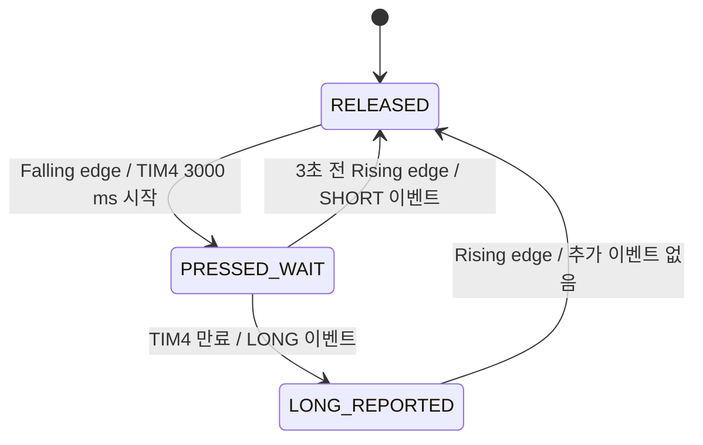
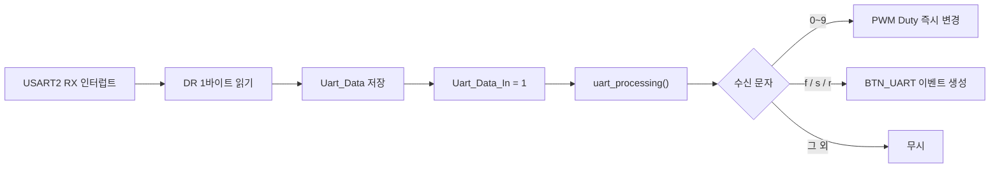

# [3조] 모터 제어 상위설계서

신유지, 이호윤, 이양배, 한소영

## 1. 요구 사항

* 모터는 버튼과 UART 명령 두 가지 방식으로 제어
* 전원 인가 시 모터는 정지 상태
* 메인 루프는 UART 처리, 버튼 처리, 모터 상태 처리를 반복 수행
* 방향 전환 시 모터 부하 방지를 위해 전환 간 대기시간 필요
* UART로 PWM Duty Rate를 50%에서 95%까지 설정할 수 있어야 한다.
* 위 요구사항에 명시되지 않은 세부 구현 방식은 자유롭게 설계한다.

## 2. 상태 및 이벤트

### 2-1. 모터 상태

| 이름 | 값 | PA0 | PA1 | 설명 |
|---|:---:|---|---|---|
| `MOTOR_STOP` | 0 | GPIO LOW | GPIO LOW | 모터 정지 |
| `MOTOR_CW` | 1 | GPIO LOW | TIM5_CH2 PWM | 소프트웨어 기준 정방향 회전 |
| `MOTOR_CCW` | 2 | TIM5_CH1 PWM | GPIO LOW | 소프트웨어 기준 역방향 회전 |

### 3-2. 버튼/UART 이벤트

| 이름 | 값 | 발생 조건 | 처리 결과 |
|---|:---:|---|---|
| `BTN_NONE` | 0 | 초기 상태 또는 이벤트 처리 완료 | 모터 상태 변경 없음 |
| `BTN_SHORT_PRESSED` | 1 | 버튼을 누른 후 3초 이내에 해제 | STOP→CW, CW↔CCW |
| `BTN_LONG_PRESSED` | 2 | 버튼을 누른 상태로 약 3초 경과 | CW 또는 CCW 상태에서 STOP |
| `BTN_UART` | 3 | UART로 `'f'`, `'s'`, `'r'` 중 하나 수신 | 수신 문자에 따라 CW, STOP, CCW |


### 3-4. 상태별 이벤트 처리표

| 현재 상태 | 입력 이벤트/명령 | 다음 상태 | 수행 함수 | 전환 전 정지 지연 |
|---|---|---|---|:---:|
| `MOTOR_STOP` | 버튼 짧게 누름 | `MOTOR_CW` | `motor_cw()` | 없음 |
| `MOTOR_STOP` | 버튼 길게 누름 | `MOTOR_STOP` | 없음 | 없음 |
| `MOTOR_CW` | 버튼 짧게 누름 | `MOTOR_CCW` | `motor_stop_delay()` → `motor_ccw()` | 적용 |
| `MOTOR_CW` | 버튼 길게 누름 | `MOTOR_STOP` | `motor_stop()` | 없음 |
| `MOTOR_CCW` | 버튼 짧게 누름 | `MOTOR_CW` | `motor_stop_delay()` → `motor_cw()` | 적용 |
| `MOTOR_CCW` | 버튼 길게 누름 | `MOTOR_STOP` | `motor_stop()` | 없음 |
| 모든 상태 | UART `'f'` | `MOTOR_CW` | `motor_cw()` | 미적용 |
| 모든 상태 | UART `'s'` | `MOTOR_STOP` | `motor_stop()` | 없음 |
| 모든 상태 | UART `'r'` | `MOTOR_CCW` | `motor_ccw()` | 미적용 |
| 모든 상태 | UART `'0'`~`'9'` | 현재 상태 유지 | `TIM5_Out_PWM_Generation()` | 해당 없음 |

## 4. 버튼 입력 처리

### 4-1. 버튼 판정 방식

| PC13 입력 | 판정 함수 | 의미 |
|:---:|---|---|
| LOW | `Key_Get_Pressed()` | 버튼 눌림 |
| HIGH | `Key_Get_Released()` | 버튼 해제 |

Falling edge와 Rising edge를 모두 검출  
ISR에서는 긴 처리를 하지 않고 `Key_event_generated`만 1로 설정한다. 실제 눌림·해제 판정은 메인 루프의 `button_scan()`에서 수행한다.

### 4-2. 짧게/길게 누름 판정 흐름



1. 버튼을 누르면 EXTI 인터럽트가 발생한다.
2. `button_scan()`은 PC13이 LOW임을 확인하고 TIM4를 약 3000 ms로 시작한다.
3. 3000 ms 전에 버튼을 해제하면 TIM4를 정지하고 `BTN_SHORT_PRESSED`를 발생시킨다.
4. 버튼을 계속 누르면 TIM4 ISR이 `TIM4_Expired`를 1로 설정한다.
5. `button_check_long_press()`는 버튼이 여전히 눌려 있으면 `BTN_LONG_PRESSED`를 발생시키고 TIM4를 정지한다.
6. 길게 누름이 이미 발생한 뒤 버튼을 해제할 때는 짧게 누름 이벤트를 추가로 만들지 않는다.

## 5. UART 입력 처리

### 5-1. 수신 처리 구조


### 5-2. UART 명령

| 명령 | 기능 | 결과 |
|:---:|---|---|
| `'f'` | 정방향 명령 | `motor_cw()` 호출 |
| `'s'` | 정지 명령 | `motor_stop()` 호출 |
| `'r'` | 역방향 명령 | `motor_ccw()` 호출 |
| `'0'` | 속도 단계 0 | PWM Duty 50% |
| `'1'` | 속도 단계 1 | PWM Duty 55% |
| `'2'` | 속도 단계 2 | PWM Duty 60% |
| `'3'` | 속도 단계 3 | PWM Duty 65% |
| `'4'` | 속도 단계 4 | PWM Duty 70% |
| `'5'` | 속도 단계 5 | PWM Duty 75% |
| `'6'` | 속도 단계 6 | PWM Duty 80% |
| `'7'` | 속도 단계 7 | PWM Duty 85% |
| `'8'` | 속도 단계 8 | PWM Duty 90% |
| `'9'` | 속도 단계 9 | PWM Duty 95% |

## 6. PWM 및 타이머

### 6-1. TIM5 모터 PWM

| 항목 | 설정값 |
|---|---|
| TIM5 기준 주파수 | 8 MHz |
| PWM 주파수 | 10 kHz |
| 출력 채널 | CH1, CH2 |
| 카운터 모드 | Down counter |
| 반복 모드 | Repeat |
| 초기 Duty | 75% (`range = 5`) |
| Duty 범위 | 50~95% |

### 6-2. TIM4 길게 누름 타이머

| 항목 | 설정값 |
|---|---|
| TIM4 Tick | 1000 μs |
| TIM4 기준 주파수 | 1 kHz |
| 길게 누름 설정값 | 3000 ms |
| 인터럽트 | Update interrupt, IRQ 30 |

## 7. 변수

### 7-1. 열거형 및 구조체

```c
typedef enum
{
    MOTOR_STOP,
    MOTOR_CW,
    MOTOR_CCW
} MOTOR_STATE;

typedef enum
{
    BTN_NONE,
    BTN_SHORT_PRESSED,
    BTN_LONG_PRESSED,
    BTN_UART
} BUTTON_EVENT;

typedef struct Button
{
    BUTTON_EVENT event;
    int pressed;
    int long_pressed;
} BUTTON;
```

### 7-2. 전역 변수

| 이름 | 형식 | 초기값 | 쓰는 위치 | 읽고 처리하는 위치 | 역할 |
|---|---|:---:|---|---|---|
| `Key_event_generated` | `volatile int` | 0 | `EXTI15_10_IRQHandler()` | `button_scan()` | PC13 edge 발생 알림 |
| `Uart_Data_In` | `volatile int` | 0 | `USART2_IRQHandler()` | `uart_processing()` | UART 새 데이터 수신 알림 |
| `Uart_Data` | `volatile unsigned char` | 0 | `USART2_IRQHandler()` | `uart_processing()`, `motor_handle()` | 최근 수신 문자 1바이트 |
| `TIM4_Expired` | `volatile int` | 0 | `TIM4_IRQHandler()` | `button_check_long_press()` | TIM4 만료 알림 |
| `btn` | `BUTTON` | `button_init()`에서 초기화 | 버튼/UART 처리 함수 | `motor_handle()` | 현재 입력 이벤트 및 버튼 상태 |
| `motor_state` | `MOTOR_STATE` | `MOTOR_STOP` | 모터 제어 함수 | `motor_handle()` | 현재 모터 상태 |

## 9. 주요 함수

### 9-1. 시스템 초기화 및 메인 제어

| 함수 | 입력 값 | 출력 값 | 변경하는 변수 | 역할 |
|---|---|---|---|---|
| `Sys_Init(int baud)` | `baud` | 없음 (`void`) | `SCB->CPACR`, 클록·USART2·LED 관련 레지스터, 표준 출력 버퍼 설정 | 클록, USART2, 표준 출력, LED 초기화 |
| `Main()` | 없음 | 없음 (`void`, 반환하지 않음) | 하위 함수를 통해 `btn`, `motor_state`, GPIO·TIM4·TIM5·USART2 관련 레지스터 변경 | 장치를 초기화하고 UART·버튼·모터 처리를 무한 반복 |

### 9-2. TIMER 제어

| 함수 | 입력 값 | 출력 값 | 변경하는 변수 | 역할 |
|---|---|---|---|---|
| `TIM5_Out_Init()` | 없음 | 없음 (`void`) | `RCC->APB1ENR`, `TIM5->CCMR1`, `TIM5->CCER` | TIM5_CH1·CH2 PWM 출력 기능 초기화 |
| `TIM5_Out_PWM_Generation(int range)` | `range` 0~9 | 없음 (`void`) | `TIM5->PSC`, `ARR`, `CCR1`, `CCR2`, `EGR`, `CR1` | 10 kHz PWM과 50~95% Duty 설정 |
| `TIM5_Out_Stop()` | 없음 | 없음 (`void`) | `TIM5->CR1`의 CEN 비트 | TIM5 정지. 현재 메인 흐름에서는 호출하지 않음 |
| `TIM4_Repeat_Interrupt_Enable(int en, int time)` | `en`, `time`(ms) | 없음 (`void`) | RCC·TIM4 관련 레지스터와 NVIC IRQ 30 설정 | 지정 시간으로 TIM4 Update 인터럽트 시작 또는 비활성화 |
| `TIM4_Stop()` | 없음 | 없음 (`void`) | `TIM4->CR1`, `TIM4->DIER`, `TIM4->SR`, NVIC IRQ 30 Pending 상태 | TIM4와 Update 인터럽트를 정지하고 Pending 상태 정리 |

### 9-4. 모터 설정

| 함수 | 입력 값 | 출력 값 | 변경하는 변수 | 역할 |
|---|---|---|---|---|
| `motor_init()` | 없음 | 없음 (`void`) | `RCC->AHB1ENR`, `GPIOA->MODER`, `OTYPER`, `ODR`, `motor_state` | 모터 출력 LOW 및 정지 상태 초기화 |
| `PAx_PWM_set(int pin_num)` | `pin_num` 0 또는 1 | 없음 (`void`) | `GPIOA->MODER`, `GPIOA->AFR[0]` | 지정 핀을 AF2 PWM 출력으로 변경 |
| `PAx_GPIO_set(int pin_num)` | `pin_num` 0 또는 1 | 없음 (`void`) | `GPIOA->MODER`, `GPIOA->OTYPER`, `GPIOA->ODR` | 지정 핀을 Push-pull GPIO LOW로 변경 |
| `motor_stop()` | 없음 | 없음 (`void`) | `GPIOA->MODER`, `GPIOA->ODR`, `motor_state` | PA0·PA1을 LOW로 설정하고 모터 정지 |
| `motor_cw()` | 없음 | 없음 (`void`) | `GPIOA->MODER`, `OTYPER`, `ODR`, `AFR[0]`, `motor_state` | PA0은 LOW, PA1은 PWM으로 설정하여 정방향 출력 |
| `motor_ccw()` | 없음 | 없음 (`void`) | `GPIOA->MODER`, `OTYPER`, `ODR`, `AFR[0]`, `motor_state` | PA1은 LOW, PA0은 PWM으로 설정하여 역방향 출력 |
| `motor_stop_delay()` | 없음 | 없음 (`void`) | `GPIOA->MODER`, `GPIOA->ODR`, `motor_state` | 모터를 정지하고 Busy-wait하여 버튼 방향 전환 전 정지 구간 제공 |
| `motor_handle()` | `motor_state`, `btn.event`, `Uart_Data` | 없음 (`void`) | `motor_state`, `btn.event`, 모터 출력 관련 GPIOA 레지스터 | 현재 상태와 입력 이벤트에 따라 모터를 제어하고 처리한 이벤트 소거 |

### 9-5. 버튼 입력 및 처리

| 함수 | 입력 값 | 출력 값 | 변경하는 변수 | 역할 |
|---|---|---|---|---|
| `button_init()` | 없음 | 없음 (`void`) | `RCC->AHB1ENR`, `GPIOC->MODER`, `GPIOC->PUPDR`, `btn.event`, `btn.pressed`, `btn.long_pressed` | PC13 입력·Pull-up과 버튼 상태 초기화 |
| `button_scan()` | `Key_event_generated`, PC13 입력, `btn.long_pressed` | 없음 (`void`) | `Key_event_generated`, `btn.event`, `btn.pressed`, `btn.long_pressed`, TIM4 관련 레지스터 | 버튼 누름·해제를 판정하고 짧게 누름 이벤트 생성 |
| `button_check_long_press()` | `TIM4_Expired`, `btn.pressed` | 없음 (`void`) | `TIM4_Expired`, `btn.event`, `btn.long_pressed`, TIM4 관련 레지스터 | TIM4 만료 시 버튼이 계속 눌렸는지 확인하고 길게 누름 이벤트 생성 |
| `button_processing()` | 버튼·TIM4 전역 상태 | 없음 (`void`) | 하위 함수를 통해 버튼 상태, 이벤트 플래그, TIM4 관련 레지스터 변경 | 버튼 스캔과 길게 누름 판정을 순서대로 호출 |
| `Key_Get_Pressed()` | `GPIOC->IDR`의 PC13 값 | `int`: 눌림이면 1, 아니면 0 | 없음 | PC13이 LOW인지 확인 |
| `Key_Get_Released()` | `GPIOC->IDR`의 PC13 값 | `int`: 해제이면 1, 아니면 0 | 없음 | PC13이 HIGH인지 확인 |
| `Key_ISR_Enable(int en)` | `en` | 없음 (`void`) | RCC·GPIOC·SYSCFG·EXTI 관련 레지스터와 NVIC IRQ 40 설정 | EXTI13 양쪽 edge 인터럽트 활성화 또는 NVIC 인터럽트 비활성화 |

### 9-6. UART

| 함수 | 입력 값 | 출력 값 | 변경하는 변수 | 역할 |
|---|---|---|---|---|
| `uart_processing()` | `Uart_Data_In`, `Uart_Data` | 없음 (`void`) | `Uart_Data_In`, `btn.event`, TIM5 PWM 관련 레지스터 | 숫자 명령은 PWM Duty로, `f/s/r` 명령은 모터 이벤트로 변환 |
| `Uart2_Init(int baud)` | `baud` | 없음 (`void`) | RCC·GPIOA·USART2 관련 레지스터 | PA2·PA3를 AF7로 설정하고 USART2 초기화 |
| `Uart2_RX_Interrupt_Enable(int en)` | `en` | 없음 (`void`) | `USART2->CR1`의 RXNEIE 비트, NVIC IRQ 38 설정 | USART2 수신 인터럽트 활성화 또는 비활성화 |

### 9-6. IRQ

| ISR | 발생 원인 | ISR 처리 | 후속 처리 |
|---|---|---|---|
| `EXTI15_10_IRQHandler()` | PC13 Falling/Rising edge | `Key_event_generated = 1`, EXTI/NVIC Pending clear | `button_scan()`이 현재 핀 상태를 판독 |
| `USART2_IRQHandler()` | USART2 RXNE | `USART2->DR`을 `Uart_Data`에 저장, `Uart_Data_In = 1` | `uart_processing()`이 명령 해석 |
| `TIM4_IRQHandler()` | TIM4 Update | TIM4/NVIC Pending clear, `TIM4_Expired = 1` | `button_check_long_press()`가 길게 누름 판정 |